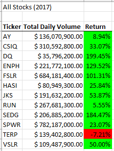
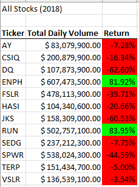

# Stock Analysis

## Overview of Project
We were given an [Excel workbook](./resources/VBA_Challenge.xlsm) containing two years of stock data for twelve specific stocks. In the workbook were several Visual Basic for Applications (VBA) macros to help display statistics about the stock data, but the code ran somewhat slowly. We want to know if we can obtain the same results, but faster. So we will refactor the code in an attempt to do so.

## The Code

### Original Attempt
The original VBA code (found in Module1 of the Visual Basic Editor) involved making a pass through every stock transaction in the data[^1] in order to compile statistics for a given stock ticker code ("ticker"). The data was then output to an available line on the output worksheet, and the process was then repeated for each remaining ticker in the set.

[^1]: Note that, in order for the compiled statistics to be accurate, the stock transactions first had to be sorted by ticker, and then by date (ascending).

### Refactored Attempt
The code was rewritten (in Module2 of the Visual Basic Editor) so that the stock-ticker statistics could be held in arrays in RAM.

In addition, the main action of the statistics' compilation was altered so that all stocks' statistics could be compiled in a single pass[^1]. Rather than scan the enire data set for each ticker—as the original attempt did—the refactored version instead stores each statistic's data in an array cell whose index corresponds to the stock in question. When the system begins to encounter transactions for a new ticker, it simply changes the index it uses.

After the statistical compilation pass completes and statistics have been compiled in the statistical arrays for all stock tickers, the contents of the arrays are then transferred to the worksheet.

## Results
Both versions of the code produced the same output[^2] (as desired), as seen in the following screenshots:

[^2]: The original attempt formatted the output slightly differently (found [here](./resources/green_stocks_2017.png) and [here](./resources/green_stocks_2018.png)). Importantly, though, the actual data—the contents of the table—is the same between both versions.

| **2017** | **2018** |
| --- | --- |
|  |  |

The refactored version of the code, however, produced its results in a much shorter time than the original version did. The original code required .56 and .59 seconds, respectively, to produce the 2017 and 2018 data, whereas the refactored code required only .19 seconds, each.

| | **2017** | **2018** |
| --- | --- | --- |
| **Original** |  |  |
| **Refactored** |  |  |

## Summary
[In a summary statement, address the following questions:]
1. What are the advantages or disadvantages of refactoring code?
2. How do these pros and cons apply to refactoring the original VBA script?
